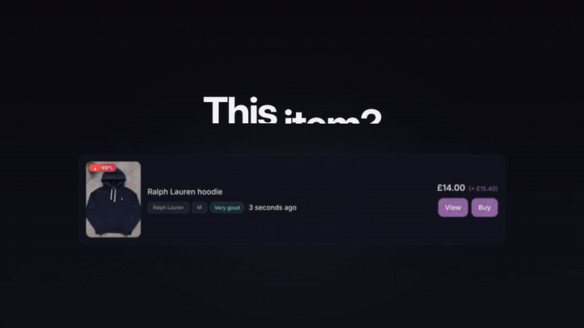
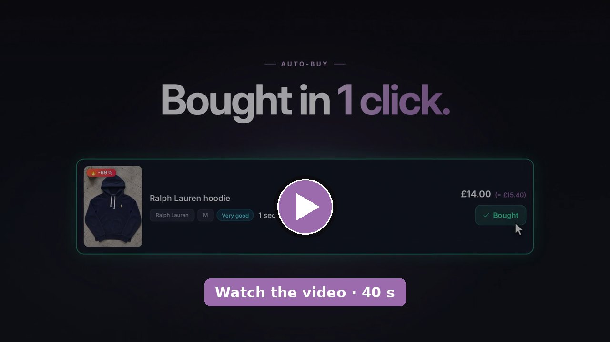

[Français](README.md) · **English**

# VINTI — the Vinted bot

### Be first on every Vinted deal.

*While others scroll, you buy.*

**VINTI watches Vinted 24/7, alerts you within milliseconds and can buy for you.**

[**See the plans**](https://vinti.shop/#pricing)

---

## What VINTI does

1. **It watches Vinted for you, 24/7**, based on the searches you create.
2. **It alerts you within milliseconds**, as soon as a matching listing goes live.
3. **It reaches you wherever you are**: in the VINTI app, by push notification, on Discord or on Telegram.
4. **It lets you buy in 1 click** with Auto-Buy, straight from the real-time feed.
5. **Your account stays with you**: your Vinted account is only used from the desktop app, on your own connection and at a natural pace — never from our servers.

## The video

Click the image to play the video (40 s).

## Who is it for?

- **Thrifters and fashion lovers** — the piece you've been hunting for weeks finally shows up? You know right away.
- **Families and small budgets** — kids' clothes in the right size, at the right price, without spending your evenings scrolling.
- **Collectors** — sneakers, vintage, sought-after brands: be there before the gem is gone.
- **Resellers and shops** — searches running non-stop, across every Vinted country, to find the right stock at the right price.

## Features

### Real-time feed
Every listing that matches one of your searches appears instantly in the VINTI app feed, with photo, price, brand, size and condition.

### Discord & Telegram alerts
Get your finds on your own Discord server (personal webhook, one alert per search, with the link to the listing) or on Telegram through your own bot, created in 2 minutes with @BotFather. Included in every plan, along with browser and phone push notifications.

 Illustrative example (French interface).

### Auto-Buy: 1-click buying
Like a listing? Click "Buy" in the real-time feed: the purchase goes through your VINTI desktop app, with your own Vinted account. If your bank asks for 3D Secure, VINTI shows it to you. Available from the Plus plan.

### Every Vinted country, chosen per search
For each search, you pick the Vinted country to watch. Keywords, category, brand, size, condition, colour, material, min and max price, excluded words and sellers, minimum seller rating: it's all in "My filters". You can also import a Vinted search URL.

 Illustrative example (French interface).

### Family Mode
With the Professional plan, invite your loved ones by email. Each member gets their own space and links their own Vinted account.

 Illustrative example (French interface).

### The VINTI desktop app, for Windows & Mac
It links your Vinted account and places your purchases from your computer. It keeps running in the background when you close the window.

## Plans

Prices include VAT, per month.

| | **Essential** | **Plus** | **Professional** | **Enterprise** |
|---|:---:|:---:|:---:|:---:|
| Price | **€9.99** | **€39.99** | **€79.99** | Custom quote |
| For | Getting started and receiving deals live | Most popular: 1-click buying on top | Search without limits, alone or together | Volume, white label, dedicated support |
| Simultaneous searches | 10 | 30 | **Unlimited** | Custom |
| Real-time feed | ✓ | ✓ | ✓ | ✓ |
| Every Vinted country | ✓ | ✓ | ✓ | ✓ |
| Discord & Telegram alerts | ✓ | ✓ | ✓ | ✓ |
| Auto-Buy (1-click buying) | — | ✓ | ✓ | ✓ |
| Family Mode | — | — | ✓ | ✓ |

**3-month commitment** when you subscribe. You can cancel at any time; cancellation takes effect at the end of the 3 months (early-termination fee capped at €50 incl. VAT). After that, cancel freely with 14 days' notice. Secure payment by Shopify. Details in the [terms of service](https://vinti.shop/policies/terms-of-service).

### Professional: power your own community

Running a Discord server or a Telegram group? With **Professional and its unlimited searches**, create as many searches as you need and send each one to the channel of your choice: sneakers, vintage, kids, bargains… Your community gets deals as soon as they go live, and you offer them a real alert service.

[**Choose my plan**](https://vinti.shop/#pricing)

## Your account's safety

> Your Vinted account is only used from the desktop app, on your own connection and at a natural pace — never from our servers.

Learn more: [how VINTI is built](https://vinti.shop/fr/pages/bot-vinted-sans-ban) (in French).

## FAQ

**How do I get started?**
Choose a plan on [vinti.shop](https://vinti.shop/#pricing), create your password, install the VINTI desktop app (Windows or Mac), log in to Vinted to link your account, then create your searches in "My filters".

**Does Auto-Buy buy without me?**
No. Auto-Buy is 1-click buying: you see the listing, you click, it's bought. Discord and Telegram alerts open the listing on Vinted.

**Do I need to keep my computer on?**
For full monitoring and Auto-Buy, yes: your computer must stay on with the desktop app running (it keeps running in the background when you close the window).

**Which Vinted countries can I watch?**
Every Vinted country. You choose the country for each search.

**Can I cancel?**
Yes. Subscriptions come with a 3-month commitment; if you cancel during that period, it takes effect at the end of the 3 months. After that, cancel whenever you like with 14 days' notice.

## Guides

- [Vinted bot UK: see new listings first and buy in one click](https://vinti.shop/blogs/actualites/vinted-bot-uk)
- In French: [Vinted alerts](https://vinti.shop/fr/blogs/guides/alerte-vinted-notification) · [search tips](https://vinti.shop/fr/blogs/guides/astuces-recherche-vinted) · [Autocop, sniper or Auto-Buy](https://vinti.shop/fr/blogs/guides/autocop-auto-buy-vinted) · [Souk or VINTI](https://vinti.shop/fr/blogs/guides/vinti-ou-souk) · [buying on Vinted abroad](https://vinti.shop/fr/blogs/guides/acheter-vinted-etranger) · [family on a budget](https://vinti.shop/fr/blogs/guides/vinted-famille-petit-prix) · [saved search notifications](https://vinti.shop/fr/blogs/guides/recherche-sauvegardee-vinted-notification)

---

### Be first on every Vinted deal.

[**See the plans on vinti.shop**](https://vinti.shop/#pricing) · [Join the Discord](https://discord.gg/XtHueHB9hm)

[Terms of service](https://vinti.shop/policies/terms-of-service) · [Privacy](https://vinti.shop/policies/privacy-policy) · © VINTI

