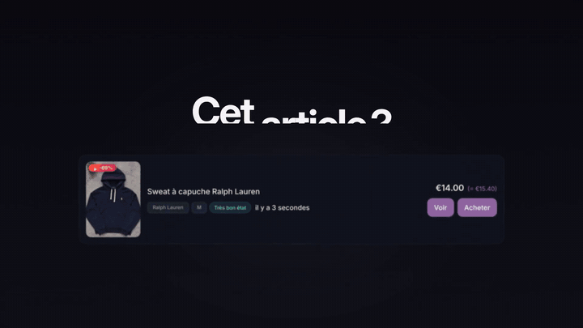
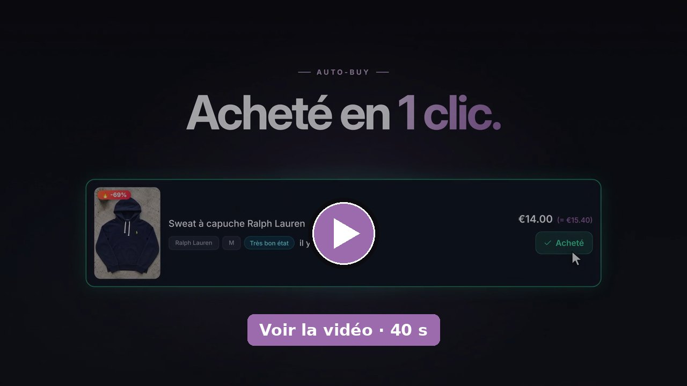
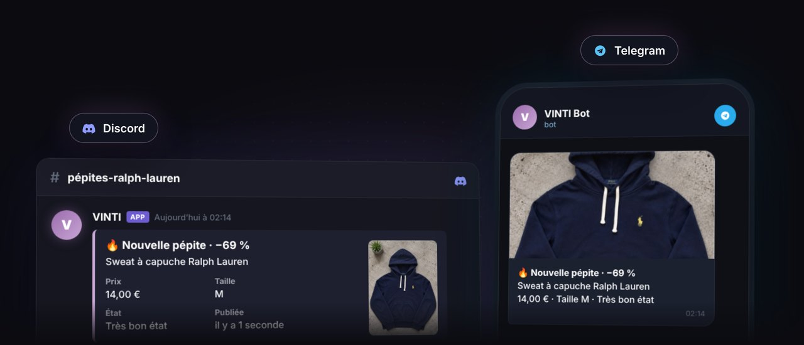
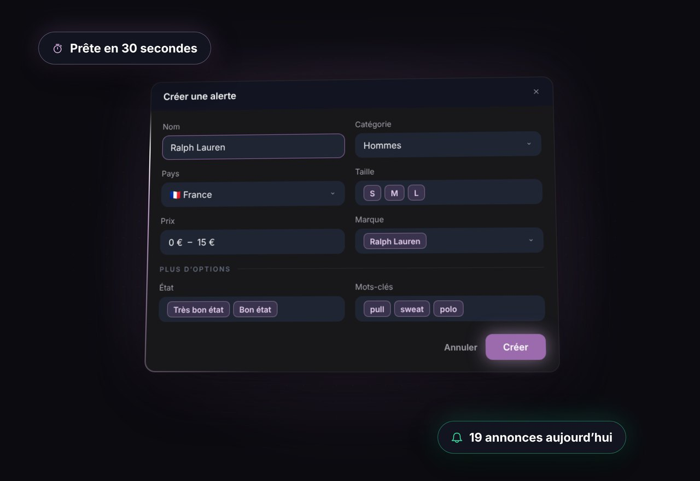
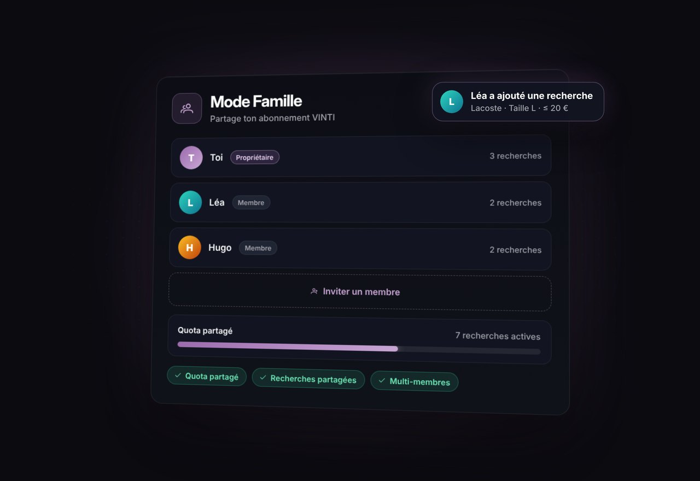

**Français** · [English](README.en.md)

# VINTI — le bot Vinted

### Soyez le premier sur chaque bonne affaire Vinted.

*Pendant que les autres scrollent, vous achetez.*

**VINTI surveille Vinted 24h/24, vous alerte en quelques millisecondes et peut acheter à votre place.**

[**Voir les formules**](https://vinti.shop/fr#pricing)

---

## Ce que fait VINTI

1. **Il surveille Vinted pour vous, 24h/24, 7j/7**, selon les recherches que vous avez créées.
2. **Il vous alerte en quelques millisecondes**, dès la mise en ligne d'une annonce qui vous correspond.
3. **Il vous prévient où vous êtes** : dans l'app VINTI, en notification push, sur Discord ou sur Telegram.
4. **Il vous laisse acheter en 1 clic** grâce à l'Auto-Buy, directement depuis le Flux en temps réel.
5. **Votre compte reste chez vous** : votre compte Vinted n'est utilisé que depuis l'app de bureau, sur votre propre connexion et à un rythme naturel — jamais depuis nos serveurs.

## La vidéo

Cliquez sur l'image pour lancer la vidéo (40 s).

## Pour qui ?

- **Les chineurs et passionnés de mode** — la pièce que vous cherchez depuis des semaines arrive enfin ? Vous êtes prévenu tout de suite.
- **Les familles et petits budgets** — vêtements enfants dans la bonne taille, au bon prix, sans passer vos soirées à faire défiler les annonces.
- **Les collectionneurs** — sneakers, vintage, marques prisées : soyez là avant que la pépite ne parte.
- **Les revendeurs et boutiques** — des recherches en continu, sur tous les pays Vinted, pour trouver le bon stock au bon prix.

## Fonctionnalités

### Flux en temps réel
Chaque annonce qui correspond à l'une de vos recherches apparaît aussitôt dans le « Fil d'actualités » de l'app VINTI, avec photo, prix, marque, taille et état.

### Alertes Discord & Telegram
Recevez vos trouvailles sur votre propre serveur Discord (webhook personnel, une alerte par recherche, avec le lien vers l'annonce) ou sur Telegram via votre propre bot, créé en 2 minutes avec @BotFather. Incluses dans toutes les formules, comme les notifications push sur navigateur et téléphone.

 Exemple illustratif.

### Auto-Buy : l'achat en 1 clic
Une annonce vous plaît ? Cliquez sur « Acheter » dans le Flux en temps réel : l'achat est passé par votre app de bureau VINTI, avec votre compte Vinted. Si votre banque demande une validation 3D Secure, VINTI vous l'affiche. Disponible à partir de la formule Plus.

### Tous les pays Vinted, au choix par recherche
Pour chaque recherche, vous choisissez le pays Vinted à surveiller. Mots-clés, catégorie, marque, taille, état, couleur, matière, prix minimum et maximum, mots et vendeurs exclus, note minimale du vendeur : tout se règle dans « Mes filtres ». Vous pouvez aussi importer une URL de recherche Vinted.

 Exemple illustratif.

### Mode Famille
Avec la formule Professional, invitez vos proches par e-mail. Chaque membre a son propre espace et relie son propre compte Vinted.

 Exemple illustratif.

### L'app de bureau VINTI, sur Windows & Mac
Elle relie votre compte Vinted et passe vos achats depuis votre ordinateur. Elle continue de tourner en arrière-plan quand vous fermez la fenêtre.

## Formules

Prix TTC, par mois.

| | **Essential** | **Plus** | **Professional** | **Enterprise** |
|---|:---:|:---:|:---:|:---:|
| Prix | **9,99 €** | **39,99 €** | **79,99 €** | Sur devis |
| Pour qui | Pour démarrer et recevoir les bonnes affaires en direct | Le plus choisi : l'achat en 1 clic en plus | Pour chercher sans limite, seul ou à plusieurs | Volume, marque blanche, support dédié |
| Recherches simultanées | 10 | 30 | **Illimitées** | Sur mesure |
| Flux en temps réel | ✓ | ✓ | ✓ | ✓ |
| Tous les pays Vinted | ✓ | ✓ | ✓ | ✓ |
| Alertes Discord & Telegram | ✓ | ✓ | ✓ | ✓ |
| Auto-Buy (achat en 1 clic) | — | ✓ | ✓ | ✓ |
| Mode Famille | — | — | ✓ | ✓ |

**Engagement de 3 mois** à la souscription. Résiliation possible à tout moment, prise en compte à la fin des 3 mois (frais de résiliation anticipée plafonnés à 50 € TTC) ; ensuite, résiliation libre avec un préavis de 14 jours. Paiement sécurisé par Shopify. Détail dans les [conditions générales](https://vinti.shop/policies/terms-of-service).

### Professional : alimentez votre propre communauté

Vous animez un serveur Discord ou un groupe Telegram ? Avec **Professional et ses recherches illimitées**, créez autant de recherches que nécessaire et envoyez chacune d'elles dans le salon de votre choix : sneakers, vintage, enfants, petits prix… Votre communauté reçoit les bonnes affaires dès leur mise en ligne, et vous lui proposez un vrai service d'alertes.

[**Choisir ma formule**](https://vinti.shop/fr#pricing)

## Sécurité de votre compte

> Votre compte Vinted n'est utilisé que depuis l'app de bureau, sur votre propre connexion et à un rythme naturel — jamais depuis nos serveurs.

En savoir plus : [l'architecture de VINTI](https://vinti.shop/fr/pages/bot-vinted-sans-ban).

## Questions fréquentes

**Comment démarrer ?**
Choisissez une formule sur [vinti.shop](https://vinti.shop/fr#pricing), créez votre mot de passe, installez l'app de bureau VINTI (Windows ou Mac), connectez-vous à Vinted pour relier votre compte, puis créez vos recherches dans « Mes filtres ».

**L'Auto-Buy achète-t-il sans moi ?**
Non. L'Auto-Buy, c'est l'achat en 1 clic : vous voyez l'annonce, vous cliquez, c'est acheté. Les alertes Discord et Telegram, elles, ouvrent l'annonce sur Vinted.

**Dois-je laisser mon ordinateur allumé ?**
Pour une surveillance complète et l'Auto-Buy, oui : l'ordinateur doit rester allumé avec l'app de bureau lancée (elle tourne en arrière-plan quand vous fermez la fenêtre).

**Quels pays Vinted puis-je surveiller ?**
Tous les pays Vinted. Vous choisissez le pays pour chaque recherche.

**Puis-je résilier ?**
Oui. L'abonnement comporte un engagement de 3 mois ; une résiliation demandée pendant cette période prend effet à la fin des 3 mois. Ensuite, vous résiliez quand vous voulez, avec un préavis de 14 jours.

## Guides du blog

- [Alerte Vinted : recevoir une notification à chaque nouvelle annonce](https://vinti.shop/fr/blogs/guides/alerte-vinted-notification)
- [Astuces de recherche Vinted pour dénicher les pépites](https://vinti.shop/fr/blogs/guides/astuces-recherche-vinted)
- [Autocop Vinted, sniper ou Auto-Buy : lequel choisir ?](https://vinti.shop/fr/blogs/guides/autocop-auto-buy-vinted)
- [Souk ou VINTI : lequel choisir ?](https://vinti.shop/fr/blogs/guides/vinti-ou-souk)
- [Acheter sur Vinted à l'étranger : le guide](https://vinti.shop/fr/blogs/guides/acheter-vinted-etranger)
- [Habiller toute la famille sur Vinted à petit prix](https://vinti.shop/fr/blogs/guides/vinted-famille-petit-prix)
- [Recherche sauvegardée Vinted : pourquoi vous ne recevez pas les notifications](https://vinti.shop/fr/blogs/guides/recherche-sauvegardee-vinted-notification)

---

### Soyez le premier sur chaque bonne affaire Vinted.

[**Voir les formules sur vinti.shop**](https://vinti.shop/fr#pricing) · [Rejoindre le Discord](https://discord.gg/XtHueHB9hm)

[Conditions générales](https://vinti.shop/policies/terms-of-service) · [Confidentialité](https://vinti.shop/policies/privacy-policy) · © VINTI

